# ERD

## 1-1. Sprint 1 ERD 범위

| Service | Entity (table) | 역할 |
| --- | --- | --- |
| Identity | `User` (`users`) | 회원 정보. 공통 계정(email, password_hash, role, status) + 참가업체 업체/담당자 정보(business_no, company_name, manager_name, contact_enc) 포함 |
| Expo | `Expo` (`expos`) | 박람회 |
| Expo | `Booth` (`booths`) | 박람회 부스. 부스 유형(`type`), 배너 이미지 |
| Expo | `BoothApplicationGroup` (`booth_application_groups`) | 부스 참가 신청 그룹 (다중 부스 = 1 신청 단위) |
| Expo | `BoothApplication` (`booth_applications`) | 부스별 참가 신청 1건 + 상태 |
| Expo | `Post` (`posts`) | 참가 확정 업체의 부스 콘텐츠 |
| Expo | `BoothApplication` | 부스 참가 신청 |
| Payment | `Payment` (`payments`) | 부스 참가비 Mock 결제 |
| Payment | `PaymentItem` (`payment_items`) | 결제 1건의 부스별 참가비 내역 |
| Reservation | `Ticket` (`tickets`) | 박람회 방문 예약 시 발급되는 날짜별 입장권/QR. 무료(FREE)·당일유료(PAID) 구분 |
| Reservation | `CheckIn` (`check_ins`) | 셀프 체크인 기록 |
| Expo | `Consultation` (`consultations`) | 고객의 차량 구매/시승 상담 신청 1건 + 승인/반려 상태. 신청 시 Reservation의 입장권 보유 여부를 확인함 |

## 1-2. Sprint 2 ERD 범위

| Service | Entity (table) | 역할 |
| --- | --- | --- |
| Identity | `User` (`users`) | 회원 정보. 공통 계정(email, password_hash, role, status) + 참가업체 업체/담당자 정보(business_no, company_name, manager_name, contact, industry, company_address, representative_name, company_contact) + 일반회원 이름(name) |
| Expo | `Expo` (`expos`) | 박람회. 당일 입장료(`admission_fee`) 포함 |
| Expo | `Booth` (`booths`) | 박람회 부스. 부스 유형(`type`), 배너 이미지 |
| Expo | `BoothApplicationGroup` (`booth_application_groups`) | 부스 참가 신청 그룹 (다중 부스 = 1 신청 단위) |
| Expo | `BoothApplication` (`booth_applications`) | 부스별 참가 신청 1건 + 상태 |
| Expo | `Post` (`posts`) | 참가 확정 업체의 부스 콘텐츠 (부스당 1건) |
| Expo | `Vehicle` (`vehicles`) | 참가 확정 부스의 전시 차량 |
| Expo | `VehicleImage` (`vehicle_images`) | 전시 차량 이미지 (`sort_order`로 정렬) |
| Expo | `Consultation` (`consultations`) | 고객의 차량 구매/시승 상담 신청 1건 + 승인/반려 상태. 신청 시 Reservation의 입장권 보유 여부를 확인함 |
| Payment | `Payment` (`payments`) | 부스 참가비 Mock 결제 |
| Payment | `PaymentItem` (`payment_items`) | 결제 1건의 부스별 참가비 내역 |
| Payment | `AdmissionPayment` (`admission_payments`) | 당일 유료 입장권 Mock 결제. 결제 성공 시 Reservation 티켓 id·qr_token을 함께 보관 |
| Reservation | `Ticket` (`tickets`) | 박람회 방문 예약 시 발급되는 날짜별 입장권/QR. 무료(FREE)·당일유료(PAID) 구분 |
| Reservation | `CheckIn` (`check_ins`) | 셀프 체크인 기록 |

## 1-3. Sprint 3 ERD 범위

| Service | Entity (table) | 역할 |
| --- | --- | --- |
| Identity | `User` (`users`) | 회원 정보 + 참가업체 정보 + 소셜로그인 식별자(provider/provider_id) |
| Expo | `Expo` (`expos`) | 박람회. 당일 입장료·소개문구(description)·배너이미지 포함 |
| Expo | `Booth` (`booths`) | 박람회 부스. 부스 유형, 배너, 상담 접수 기본 정원(consultation_capacity) |
| Expo | `BoothApplicationGroup` | 부스 참가 신청 그룹 |
| Expo | `BoothApplication` | 부스별 참가 신청 1건 + 상태 |
| Expo | `Post` | 부스 콘텐츠 |
| Expo | `Vehicle` / `VehicleImage` | 전시 차량 + 이미지 |
| Expo | `Consultation` | 상담 신청 1건 + 상태 |
| Expo | **`ConsultationSlotCapacity`** (`consultation_slot_capacity`) | 신규 추가 — 부스별 날짜·시간대 상담 접수 정원(2026-09-20) |
| Expo | `Lead` (`leads`) | QR 스캔 리드 |
| Expo | **`Notification`** (`notifications`) | 신규 추가 — 참가업체/고객 알림(읽음처리, SSE 스트림) |
| Payment | `Payment` / `PaymentItem` | 부스 참가비 Mock 결제 |
| Payment | `AdmissionPayment` (`admission_payments`) | 당일 유료 입장권 결제 (다중 날짜 결제 1건, ticket_id/qr_token은 더 이상 이 테이블에 없음 — 아래 참고) |
| Payment | **`AdmissionPaymentTicket`** (`admission_payment_tickets`) | 신규 추가 — 결제 1건 : 티켓 N건(날짜별). 환불 시 refunded_at/refund_reason 기록 |
| Reservation | `Ticket` / `CheckIn` | 입장권/체크인 |
| Review | `Review` (`reviews`) | 후기. 작성 시점 업체명·박람회명 스냅샷(company_name/expo_title), 상담 연결(consultation_id) 포함 |
| Review | `ReviewImage` | 후기 사진 |

# 2. ERD

```mermaid
erDiagram
  %% ================= Identity 서비스 (DB: identity) =================
  User {
    bigint   id                 PK
    varchar  email              UK "NOT NULL"
    varchar  password_hash         "BCrypt(60), nullable - 소셜 전용 계정은 NULL"
    varchar  role                  "USER | EXHIBITOR | ADMIN"
    varchar  status                "ACTIVE | LOCKED | WITHDRAWN (default ACTIVE)"
    varchar  business_no        UK "EXHIBITOR만"
    varchar  company_name          "EXHIBITOR만"
    varchar  manager_name          "EXHIBITOR만"
    varchar  contact               "담당자/일반회원 연락처 공용, 평문"
    varchar  industry              "EXHIBITOR만"
    varchar  company_address       "EXHIBITOR만"
    varchar  representative_name   "EXHIBITOR만"
    varchar  company_contact       "EXHIBITOR만"
    varchar  name                  "USER만"
    varchar  provider              "GOOGLE | KAKAO | NAVER, nullable - 이메일가입은 NULL"
    varchar  provider_id           "소셜 고유ID, nullable"
    datetime created_at
    datetime updated_at
  }

  %% ================= Expo 서비스 (DB: expo) =================
  Expo {
    bigint   id                 PK
    varchar  title
    varchar  venue
    varchar  description           "박람회 소개문구, nullable"
    datetime starts_at
    datetime ends_at
    datetime apply_starts_at
    datetime apply_ends_at
    varchar  status                "DRAFT | OPEN"
    bigint   admission_fee         "default 0"
    varchar  banner_image_url      "nullable"
    datetime created_at
    datetime updated_at
  }

  Booth {
    bigint   id                 PK
    bigint   expo_id            FK
    varchar  booth_no              "UNIQUE(expo_id, booth_no)"
    varchar  type
    int      fee
    varchar  status                "AVAILABLE | RESERVED | ASSIGNED"
    varchar  banner_image_url      "nullable"
    int      consultation_capacity "시간대당 기본 상담 접수 정원, default 1"
  }

  BoothApplicationGroup {
    varchar  id                 PK "UUID(36)"
    bigint   exhibitor_id
    bigint   expo_id            FK
    varchar  exhibition_item
    varchar  concept_description
    tinyint  power_requested
    tinyint  water_supply_requested
    tinyint  internet_requested
    varchar  additional_request
    datetime created_at
  }

  BoothApplication {
    bigint   id                 PK
    bigint   booth_id           FK
    bigint   exhibitor_id
    varchar  group_id           FK
    varchar  status                "DRAFT | SUBMITTED | PAYMENT_PENDING | CONFIRMED | REJECTED | REFUND_REQUIRED | CANCELLED"
    varchar  reject_reason
    datetime submitted_at
  }

  Post {
    bigint   id                 PK
    bigint   booth_id           FK "UNIQUE"
    varchar  title
    varchar  content
    datetime created_at
    datetime updated_at
  }

  Vehicle {
    bigint   id                 PK
    bigint   booth_id           FK "ON DELETE CASCADE"
    varchar  name
    varchar  tags
    bigint   start_price
    varchar  summary
    varchar  description
    varchar  features
    varchar  colors
    varchar  range_info
    varchar  battery
    varchar  power
    datetime created_at
    datetime updated_at
  }

  VehicleImage {
    bigint   id                 PK
    bigint   vehicle_id         FK "ON DELETE CASCADE"
    varchar  image_url
    int      sort_order
    datetime created_at
  }

  Consultation {
    bigint   id                 PK
    bigint   booth_id           FK "ON DELETE CASCADE"
    bigint   customer_id
    varchar  customer_name
    varchar  customer_phone
    varchar  customer_email
    tinyint  wants_purchase
    tinyint  wants_test_drive
    varchar  interested_vehicle
    tinyint  has_driver_license
    date     preferred_date
    time     preferred_time
    varchar  message
    varchar  ai_summary
    int      ai_summary_retry_count
    boolean  lead_consent          "필수(@AssertTrue) - 미동의 시 신청/수정 400"
    varchar  status                "REQUESTED | APPROVED | REJECTED | CANCELED | COMPLETED | NO_SHOW"
    varchar  reject_reason
    datetime created_at
    datetime updated_at
  }

  ConsultationSlotCapacity {
    bigint   id                 PK
    bigint   booth_id           FK
    date     slot_date
    time     slot_time
    int      capacity              "0이면 마감, 미지정 슬롯은 booth.consultation_capacity 적용"
  }

  Lead {
    bigint   id                     PK
    bigint   booth_id               FK "ON DELETE CASCADE"
    bigint   customer_id
    date     visit_date
    bigint   consultation_id         FK "nullable - 워크인 NULL"
    varchar  customer_name
    varchar  customer_email
    varchar  interest_note
    varchar  email_summary
    int      email_summary_retry_count
    varchar  status                     "NEW | SENT"
    boolean  lead_consent
    datetime created_at
  }

  Notification {
    bigint   id                 PK
    bigint   recipient_id           "논리 참조 - USER 또는 EXHIBITOR id, 역할은 조회 API 경로가 결정"
    varchar  type
    varchar  title
    varchar  message
    bigint   related_id             "nullable"
    boolean  is_read               "default false"
    datetime created_at
  }

  %% ================= Payment 서비스 (DB: payment) =================
  Payment {
    bigint   id                 PK
    varchar  booking_id         UK
    bigint   user_id
    bigint   expo_id
    varchar  portone_payment_id UK
    varchar  pay_method
    bigint   amount
    varchar  status                "PENDING | PAID | FAILED | CANCELLED"
    datetime approved_at
    datetime cancelled_at
    varchar  cancel_reason
    datetime created_at
    datetime updated_at
  }

  PaymentItem {
    bigint   id                 PK
    bigint   payment_id         FK
    bigint   booth_id
    bigint   amount
  }

  AdmissionPayment {
    bigint   id                 PK
    bigint   customer_id           "INDEX (UNIQUE 제약 삭제됨 - 분할결제 허용)"
    bigint   expo_id               "INDEX"
    varchar  portone_payment_id UK
    varchar  pay_method
    bigint   amount                "1일입장료 × 날짜수 합산"
    varchar  status                "PENDING | PAID | FAILED | CANCELLED"
    datetime approved_at
    datetime cancelled_at
    varchar  cancel_reason
    datetime created_at
    datetime updated_at
  }

  AdmissionPaymentTicket {
    bigint   id                     PK
    bigint   admission_payment_id   FK
    date     visit_date
    bigint   ticket_id                  "-> reservation.Ticket.id (논리 참조)"
    varchar  qr_token
    bigint   amount                    "해당 날짜 1건 금액"
    datetime refunded_at                "nullable"
    varchar  refund_reason              "nullable"
  }

  %% ================= Reservation 서비스 (DB: reservation) =================
  Ticket {
    bigint   id                 PK
    bigint   customer_id           "INDEX"
    bigint   expo_id               "INDEX"
    date     visit_date            "UNIQUE(customer_id, expo_id, visit_date)"
    varchar  ticket_type           "FREE | PAID"
    varchar  status                "ISSUED | USED | CANCELLED"
    varchar  qr_token           UK
    datetime issued_at
    datetime used_at
    datetime created_at
    datetime updated_at
  }

  CheckIn {
    bigint   id                 PK
    bigint   ticket_id          FK
    bigint   expo_id
    datetime checked_in_at
  }

  %% ================= Review 서비스 (DB: review) =================
  Review {
    bigint   id            PK
    bigint   booth_id
    varchar  booth_no
    varchar  company_name       "작성 시점 비정규화 스냅샷"
    varchar  expo_title         "작성 시점 비정규화 스냅샷"
    varchar  review_type        "CONSULT | BOOTH"
    bigint   customer_id
    varchar  customer_name
    varchar  vehicle_name       "nullable - CONSULT만"
    bigint   consultation_id        "nullable - 상담후기 중복방지 UNIQUE, FK 없음"
    varchar  content
    datetime created_at
  }

  ReviewImage {
    bigint   id            PK
    bigint   review_id     FK "ON DELETE CASCADE"
    varchar  image_url
    int      sort_order
    datetime created_at
  }

  %% ---- 물리 FK (같은 DB 안) ----
  Expo                  ||--o{ Booth                 : ""
  Expo                  ||--o{ BoothApplicationGroup : ""
  BoothApplicationGroup ||--o{ BoothApplication      : ""
  Booth                 ||--o{ BoothApplication      : ""
  Booth                 ||--o| Post                  : ""
  Booth                 ||--o{ Vehicle               : ""
  Booth                 ||--o{ Consultation          : ""
  Booth                 ||--o{ ConsultationSlotCapacity : ""
  Booth                 ||--o{ Lead                  : ""
  Consultation          ||--o| Lead                  : "consultation_id (nullable)"
  Payment               ||--o{ PaymentItem           : ""
  AdmissionPayment       ||--o{ AdmissionPaymentTicket : ""
  Ticket                ||--o{ CheckIn               : ""
  Review                ||--o{ ReviewImage           : ""

  %% ---- 논리 참조 (서비스 경계 넘어감, FK 없음) ----
  User                  ||..o{ BoothApplicationGroup : "exhibitor_id"
  User                  ||..o{ BoothApplication      : "exhibitor_id"
  User                  ||..o{ Consultation          : "customer_id"
  User                  ||..o{ Payment               : "user_id"
  Expo                  ||..o{ Payment               : "expo_id"
  Booth                 ||..o{ PaymentItem           : "booth_id"
  User                  ||..o{ AdmissionPayment      : "customer_id"
  Expo                  ||..o{ AdmissionPayment      : "expo_id"
  Ticket                ||..o{ AdmissionPaymentTicket : "ticket_id"
  User                  ||..o{ Ticket                : "customer_id"
  Expo                  ||..o{ Ticket                : "expo_id"
  Expo                  ||..o{ CheckIn               : "expo_id"
  User                  ||..o{ Lead                  : "customer_id"
  User                  ||..o{ Notification          : "recipient_id"
  Booth                 ||..o{ Review                : "booth_id"
  User                  ||..o{ Review                : "customer_id"
  Consultation          ||..o| Review                : "consultation_id (nullable)"
```

