# 시퀀스

## 1. 정상 흐름

### F1. 참가업체 회원가입·로그인 - US2

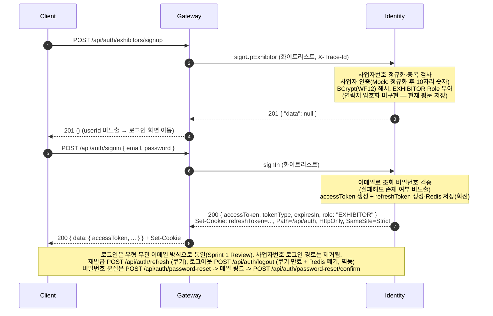

### F2. 관리자 박람회 등록·공개 — US1

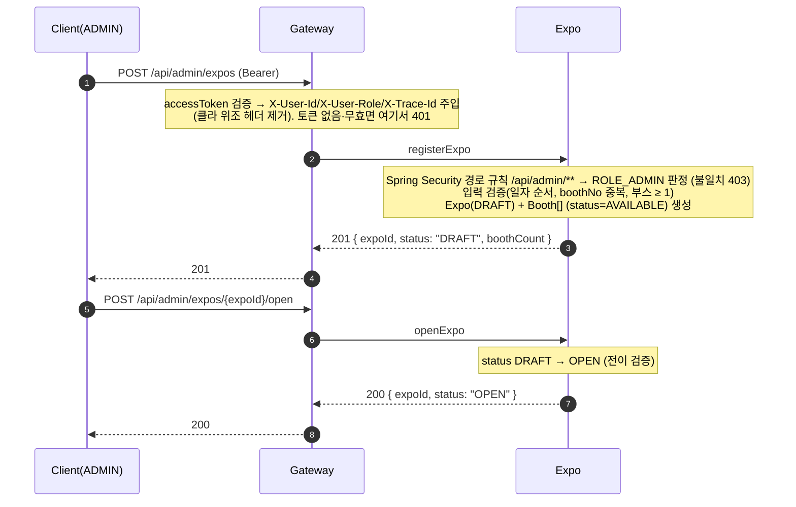

### F3. 참가업체 부스 조회·신청 — US3, US4

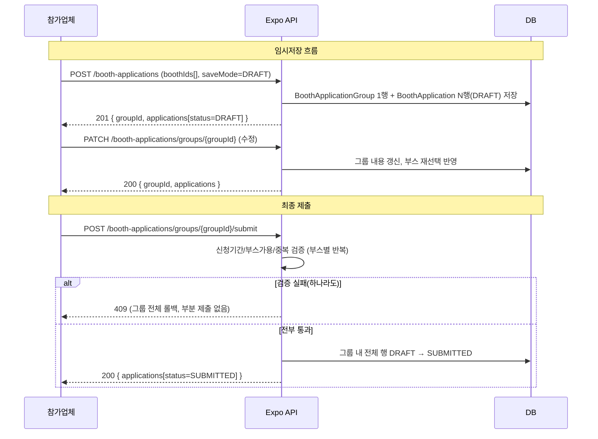

### F4. 관리자 부스 심사 — US5, US6

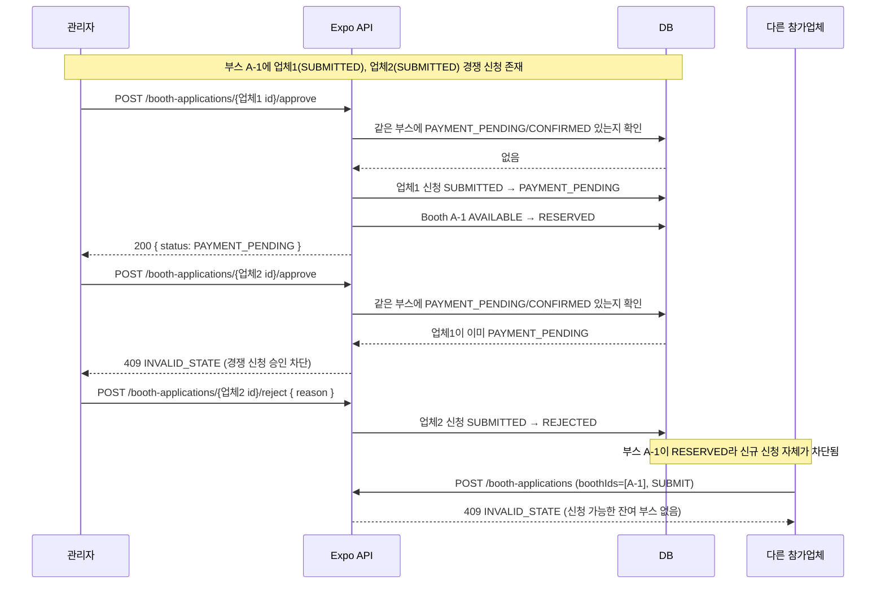

### F5. 부스 참가비 Mock 결제·참가 확정 — US7, US8

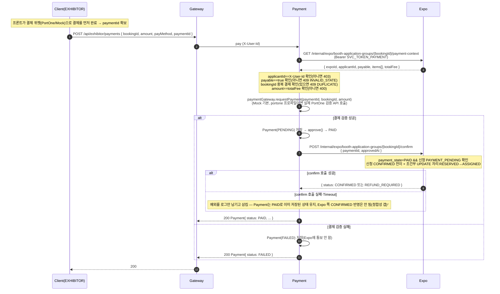

### F6. 마이페이지 신청·결제 내역 — US9

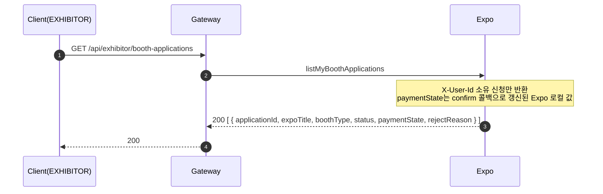

### F7. 배정 부스 콘텐츠 수정 — US10

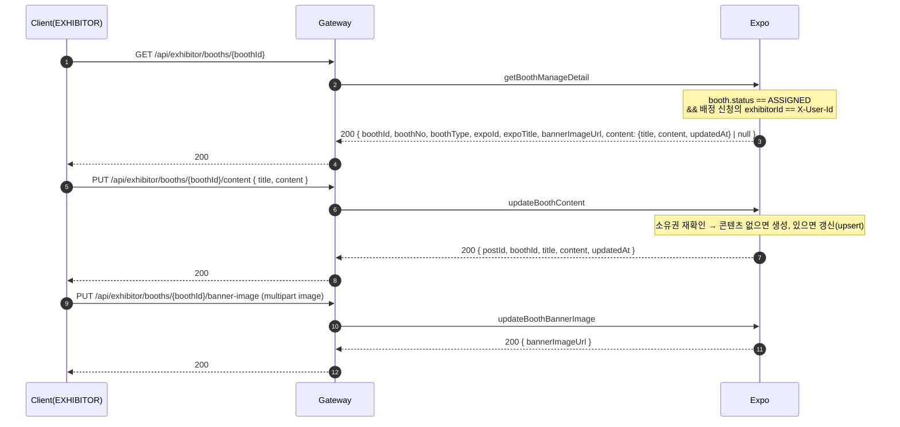

### F8. 방문 예약 신청(무료 QR 발급) — US12

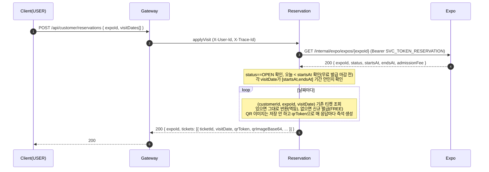

### F9. 셀프 체크인 — US23

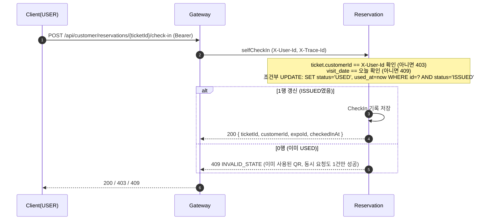

### F10. 상담 신청(입장권 보유 확인 포함) — US13·US15

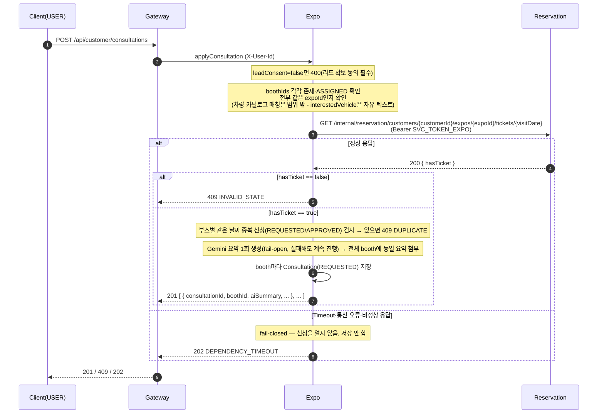

### F11. 참가업체 QR 스켄 → 상담 메모 AI 요약 → 이메일 발송

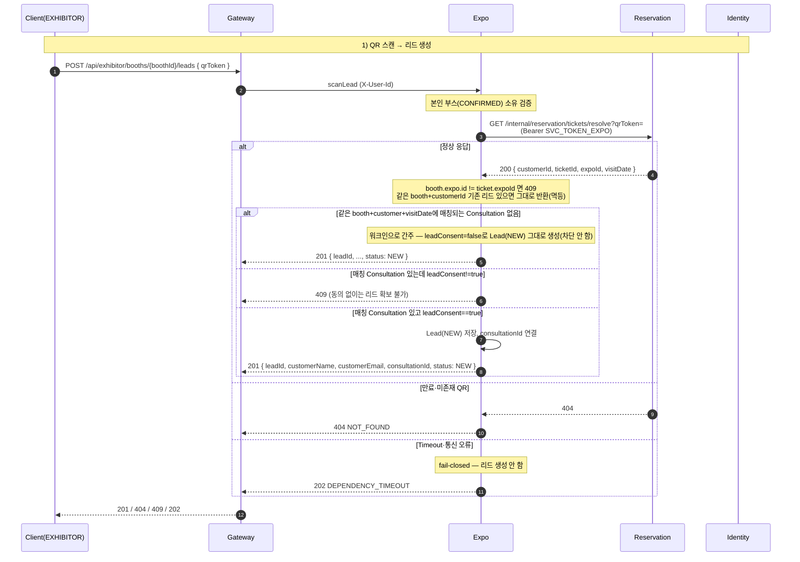

### F12. 상담후기/부스후기 작성

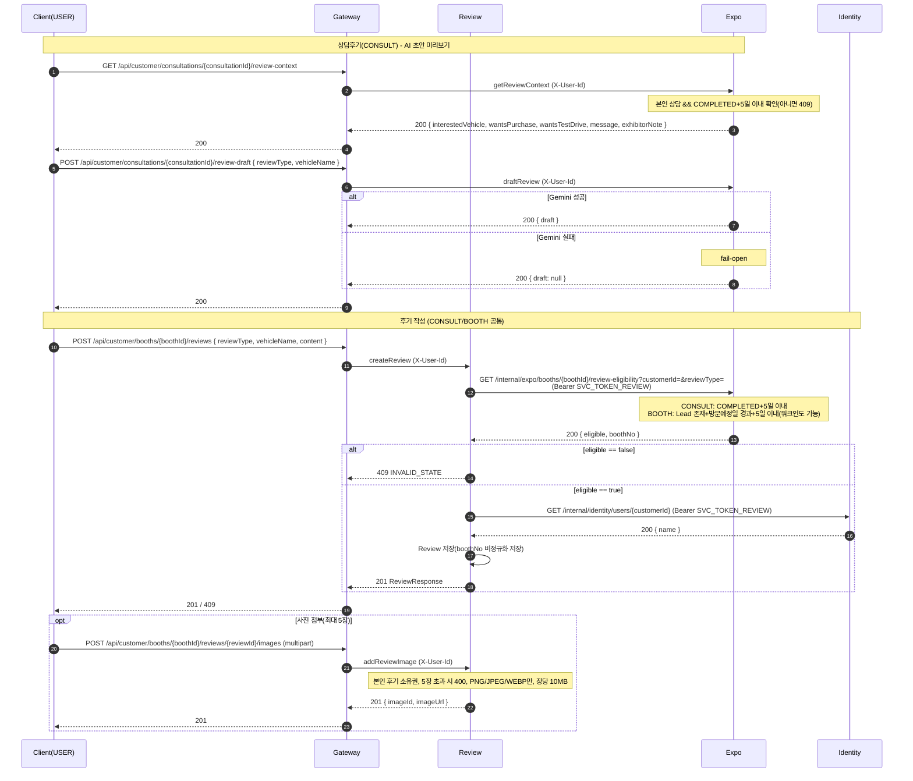

### F13. 참가업체 후기 실명 조회 + 부스 통계

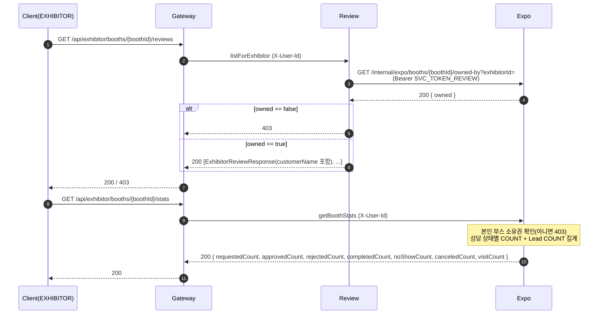

---

## 2. 실패·복구 흐름

| 시작 조건 | 관련 업무 규칙·계약 | 실패 지점 | 안전한 결과 | 재시도·복구 | 관련 Test·Sprint Demo |
| --- | --- | --- | --- | --- | --- |
| 로그인 시 이메일/비밀번호 불일치 | 민감 인증정보 비노출 / `signIn` | Identity 자격 검증 | `401 UNAUTHENTICATED` + `WWW-Authenticate: Bearer`, 존재 여부 비노출 | 사용자 재입력 | `ExhibitorSignInTest` / S1 인증 실패 Demo |
| 동일 사업자 번호로 재가입 | 사업자 번호 인증·중복 금지 / `signUpExhibitor` | Identity Unique 검사 | `409 DUPLICATE`, 계정 미생성 | 다른 사업자 번호로 가입 | `ExhibitorSignupTest` |
| 재설정 링크가 만료·위조·이미 사용·이전 링크 | 1회용 토큰·최신 링크만 유효 / `confirmPasswordReset` | Identity `PasswordResetTokenStore.consume` | `400 VALIDATION_ERROR`, 비밀번호 불변 | 다시 `requestPasswordReset` | `PasswordResetTest` |
| 토큰 없이 보호 경로 호출 | 인증 필수 / 전체 | Gateway JWT 필터 | `401` + `WWW-Authenticate: Bearer` (Service 도달 안 함) | 로그인 후 재요청 | `JwtAuthenticationFilterTest` |
| `EXHIBITOR`·GUEST가 `/api/admin/**` 호출 | 관리자 기능 접근 제한 / `registerExpo` 등 | Gateway·Service Role 검증 | `403 FORBIDDEN` + 감사 로그 | — | `AdminRouteSecurityTest` / S1 권한 실패 Demo |
| `DRAFT`가 아닌 박람회에 `open` | 상태 전이 검증 / `openExpo` | Expo 상태 검증 | `409 INVALID_STATE`, 상태 불변 | — | `ExpoAggregateTest` |
| 이미 `RESERVED`/`ASSIGNED`인 자리에 신청 | 부스 신청 조건 검증 / `applyBooth` | Expo `booth.status` 확인 | `409 INVALID_STATE`, 신청 미생성 | 다른 자리 선택 | `BoothApplicationApiTest` |
| `SUBMITTED`가 아닌 신청 승인·반려 | 부스 신청 심사 권한 / `approveBoothApplication` | Expo 상태 검증 | `409 INVALID_STATE` | — | `ApplicationReviewTransitionTest` |
| 같은 `bookingId`로 결제 재요청 | 중복 결제 방지 / `pay` | Payment `existsByBookingId` 조회 | 409 DUPLICATE | 안전(신규 결제 차단) | `PaymentService` 단위 테스트 |
| `Payment → Expo` `payment-context` 응답 Timeout | fail-closed / `bookingClient.getBooking` | Payment가 신청 정보 확인 불가 | `404 NOT_FOUND`(Optional.empty 처리), 결제 미생성 | `GET /api/exhibitor/payments/{bookingId}/status` 재조회 또는 재결제 시도 | 수동 검증 |
| 결제 기한(`expiresAt`) 경과 후 승인 | 결제 기한 기준 / `approveBoothPayment` | Payment `expiresAt` 검사 | `409 PAYMENT_EXPIRED`, 미결제 | 관리자 재승인 후 재결제 | `PaymentExpiryTest` |
| `confirm` 시 자리가 이미 `ASSIGNED` | 부스 자리 중복 확정 금지 / `confirmBoothApplicationGroup` | Expo 조건부 UPDATE 0행 | 신청 `status = REFUND_REQUIRED`, 결제는 `PAID` 유지 | 환불 대상으로 표시, 참가업체 안내 | `ApproveConfirmAcceptanceTest`  |
| 결제(`pay`)는 성공했으나 `confirm` 호출 유실·Timeout | 정상 결제 완료 건만 확정 / `confirmBoothApplicationGroup` | `bookingClient.confirm` 예외 발생 | 결제 `PAID` 유지, 신청은 `PAYMENT_PENDING`에 머무름(자동 재시도 없음) | 수동 확인 후 재처리 필요(자동 복구 로직 없음) | 수동 검증 |
| 타 참가업체의 신청·결제·자리 조회 | 참가업체 기능 접근 제한 / 소유권 | Expo·Payment 소유권 검증 | `403 FORBIDDEN` + 감사 로그 | — | `MyApplicationListTest` |
| 신청 날짜의 입장권 미보유 상태로 상담 신청 | 그 날짜 입장권 보유자만 상담 가능 / `applyConsultation` | Expo가 Reservation `hasTicketForDate` 확인 | `409 INVALID_STATE`, 신청 미생성 | 먼저 방문 예약(`applyVisit`)으로 입장권 발급 후 재신청 | 수동 검증 |
| Expo→Reservation 입장권 확인 호출 Timeout·통신 오류·내부 인증 실패 | fail-closed / `hasTicketForDate` | `ReservationHttpClient`(Expo) 예외 | `202 DEPENDENCY_TIMEOUT`, 신청 미생성(200/201로 오인 금지) | 재조회 또는 재신청 | 실제 배포 인시던트: 운영 `.env`에 `SVC_TOKEN_EXPO` 누락 -> 이 경로 상시 발생 |
| (프론트) 202 fail-closed 응답을 성공으로 오인 | HTTP 상태만으로 성공 판단 금지 | 프론트 `apiClient` 응답 처리 | 바디에 `error` 있으면 상태코드 무관 실패 처리 | `frontend/src/api/client.js` (팀원 확인 필요 — 현재 브랜치엔 미반영) | 수동 재현 |
| 같은 날짜로 방문 예약 재신청 | 방문 예약 멱등 / `applyVisit` | Reservation `(customerId, expoId, visitDate)` 조회 | 신규 생성 안 하고 기존 티켓 그대로 반환(같은 QR) | 안전(멱등) | `VisitApplicationAcceptanceTest` |
| 동시에 같은 티켓으로 체크인 10건 | QR 단일 사용 / `selfCheckIn` | Reservation 조건부 UPDATE(`WHERE status='ISSUED'`) | 1건만 `USED` 전환 성공, 나머지 9건 `409` | 안전(원자적 단일 사용) | `SelfCheckInAcceptanceTest` |
| 타인 티켓으로 셀프 체크인 시도 | 본인 소유만 체크인 가능 / `selfCheckIn` | Reservation 소유권 검증 | `403 FORBIDDEN` + 감사 로그 | — | `SelfCheckInAcceptanceTest` |
| 방문 예약일이 아닌 날짜에 체크인 시도 | 체크인은 방문 예약일 한정 / `selfCheckIn` | Reservation `visitDate` 검증 | `409 INVALID_STATE` | 방문 예약일에 재시도 | `SelfCheckInAcceptanceTest` |
| 같은 booth+customer+visitDate에 매칭 상담 없이 QR 스캔 | 워크인 허용 / `scanLead` | - | 차단 안 됨, `leadConsent=false` 리드 생성 | - | `LeadScanAcceptanceTest` |
| 매칭 상담은 있는데 `leadConsent` 미동의 상태로 QR 스캔 | 동의 없는 리드 확보 금지 / `scanLead` | Expo 검증 | `409` | 고객이 상담 신청 시 동의 후 재방문 | `LeadScanAcceptanceTest` |

---

## 3. 원칙

- 모든 동기 호출은 Gateway가 생성한 `X-Trace-Id`를 전파한다(내부 호출·로그 포함).
- 내부 계약(`/internal/**`)은 사용자 토큰이 아니라 `SVC_TOKEN_<caller>` 환경 변수 Bearer Token으로만 호출자를 검증한다.
- 서비스 간 호출에는 연결 Timeout·응답 Timeout을 명시하고, 결과를 확인하지 못하면 권한·거래를 성공으로 열지 않는다(`202` 보류 또는 fail-closed).
- 상태 변경 내부 호출은 `Idempotency-Key`로 중복 요청 시 동일 결과를 반환한다.
- 시퀀스가 바뀌면 `openapi.yaml` → API.md → 이 문서 순으로 갱신한다.