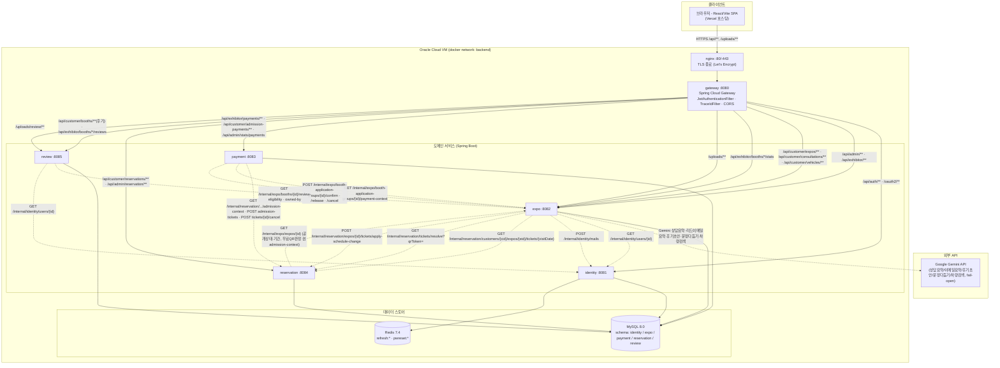

# 아키텍처

## 1. 현재 실행 구조

## 2. Component 구성

| Component | 책임 | 소유 데이터 | 관련 Story·계약 | 상태 | 추가·변경 Sprint |
| --- | --- | --- | --- | --- | --- |
| API Gateway | 클라이언트 진입점, accessToken 서명·만료 검증, X-User-Id·X-User-Role·X-Trace-Id 주입(클라 위조 헤더 제거), 요청 라우팅, CORS | 없음 | #3, #10, #18 | IMPLEMENTED | Sprint 1 |
| Identity Service | 참가업체(사업자번호)·관리자(이메일) 로그인, 회원가입, 소셜로그인(Google/Kakao/Naver), accessToken 발급·refreshToken 회전, 로그아웃, 비밀번호 재설정, 내부 사용자조회·메일발송 API 제공 | `User`(role/status/provider 포함), `refreshToken(Redis)` | #3 | IMPLEMENTED | Sprint 1 |
| Expo Service | 박람회 등록·공개·조회, 부스 참가 신청(다중선택·임시저장·그룹)·심사·참가 확정, 부스 콘텐츠 관리, 차량 상담 신청·승인/반려(Gemini 요약), 상담 슬롯 정원 관리, QR 스캔 리드 확보·AI 이메일 발송, 참가업체 통계 대시보드, 알림 | `Expo`, `Booth`, `BoothApplicationGroup`, `BoothApplication`, `Post`, `Vehicle`, `VehicleImage`, `Consultation`, `ConsultationSlotCapacity`, `Lead`, `Notification` | #3, #10, #18, STORY 6 #69, STORY 9 #156, STORY 11 #173 | IMPLEMENTED | Sprint 1~3 |
| Payment Service | 승인된 부스 참가 신청의 Mock 결제, 당일 유료 입장권 결제, 환불, 결제 상태 관리, 중복 결제 방지, 매출 통계 조회 | `Payment`, `PaymentItem`, `AdmissionPayment`, `AdmissionPaymentTicket` | #10 | IMPLEMENTED | Sprint 1~3 |
| Reservation Service | 박람회 방문 예약 신청(날짜별 QR 발급), 당일 유료 입장권 발급(Payment 연동), 입장권 상태 관리, 고객 셀프 체크인 | `Ticket`, `CheckIn` | STORY 5 #68 | DONE | Sprint 2 |
| Review Service | 부스 방문 후기(상담후기/부스후기) 작성·조회, 사진 첨부, AI 후기 초안·문장다듬기, 참가업체 실명 조회 | `Review`, `ReviewImage` | STORY 7 #70, STORY 8 #71 | DONE | Sprint 3 |

## 3. 결정 기록

| 결정 | 근거가 된 사용자 시나리오·위험 | 선택 | 검토 대안 | 결정 Sprint |
| --- | --- | --- | --- | --- |
| Sprint 1 범위를 부스 참가 및 참가비 결제까지로 한정 | 첫 Sprint에서 회원가입부터 박람회·부스 신청·결제까지 하나의 흐름을 통합 검증할 필요 | 박람회 공개 → 참가업체 가입 → 부스 신청 → 심사 → 참가비 Mock 결제 → 참가 확정 → 부스 콘텐츠 관리까지 구현 | 무료 QR·당일 입장·환불·매출 통계까지 포함하는 안은 Sprint 1 범위가 커져 제외 | Sprint 1 |
| 회원·인증 책임을 Identity로 분리 | 회원·Credential·Role의 소유 주체를 명확하게 할 필요 | Identity가 회원·인증·Role을 관리 | Expo가 참가업체 회원정보까지 관리하는 방식은 책임이 혼합되어 제외 | Sprint 1 |
| 인증은 Gateway, 인가는 Service로 분리 | Service마다 JWT 검증·키 관리를 반복하면 결합도·중복 증가, 신원 위조 방지 지점을 일원화할 필요 | Gateway가 토큰 검증 후 신뢰된 X-User-* 헤더 주입(클라 위조분 제거), 각 Service는 Spring Security 경로 규칙으로 Role만 판정 | Service마다 JWT 필터를 두는 방식은 중복·키 배포 부담 / Gateway가 Role 게이팅까지 하는 방식은 라우트별 정책 결합으로 제외 | Sprint 1 |
| CORS를 Gateway로 일원화 | Service별 CORS는 origin 목록 분산·헤더 중복 유발(Allow-Origin 중복으로 브라우저 차단 발생) | Gateway globalcors 한 곳에서 허용 origin·credentials 관리, 하위 Service CORS 제거 | Service별 @CrossOrigin·CorsConfig 유지 방식은 중복·불일치로 제외 | Sprint 1 |
| 박람회·부스·참가 신청을 Expo가 관리 | 박람회·부스·신청·심사·참가 확정 상태가 하나의 업무 흐름으로 연결됨 | Expo가 박람회와 참가 신청 상태를 관리 | 참가 신청을 별도 Service로 분리하는 방식은 현재 범위에서 복잡도가 증가하여 제외 | Sprint 1 |
| Payment를 Expo와 분리 | 참가 신청 상태와 결제 상태의 책임을 구분하고 중복 결제를 방지할 필요 | Payment가 Mock 결제와 결제 상태를 관리하고 정상 결제 결과를 Expo에 전달 | Expo가 결제 상태까지 직접 관리하는 방식은 책임이 혼합되어 제외 | Sprint 1 |
| Service별 데이터 소유권을 분리 | Service 간 DB 직접 접근 시 결합도가 높아질 위험 | 각 Service가 자신의 데이터만 변경하고 다른 Service 데이터는 ID·API로 참조 | 다른 Service DB 직접 조회·JOIN·FK 방식은 Service 경계가 무너질 수 있어 제외 | Sprint 1 |
| 부스 다중 선택 신청 시 공유 입력정보를 그룹 단위로 정규화 | 부스 여러 개를 한 번에 신청할 때 전시품목·컨셉 등 공유 정보가 부스 수만큼 중복저장되는 문제 | BoothApplicationGroup 신규 테이블 도입 — 신청 정보는 그룹이 소유, 부스별 심사 상태만 BoothApplication이 소유 | groupId 컬럼만 추가하고 정규화 안 하는 안은 데이터 중복·수정 시 정합성 깨질 위험으로 제외 | Sprint 1 |
| 부스 배정 승자 결정 방식 재정정 | 신청과 결제가 한 흐름에서 바로 안 이어지고 시간차(신청 → 관리자 승인 → 참가업체 결제)를
둠. 이전엔 "결제 완료 순(선착순)"으로 정정했었는데, 실제 업무 흐름과 불일치함을 재확인 | 관리자가 승인 시점에 직접 승자 결정. 같은 부스에 경쟁 신청이 있으면 하나만 승인 가능하도록 차단(경쟁 신청은 자동으로 승인 불가) | 여러 명을 다 승인시켜두고 결제 완료 순으로 결정하는 방식(기존 오판)은 실제 업무 흐름과 안 맞아 제외 | Sprint 1 |
| 부스 자원에 중간 잠금 상태(RESERVED) 도입 | 승인 시점과 결제 완료 시점 사이에 부스 상태를 안 바꾸면, 다른 업체가 이미 승인된 부스에
계속 신청 가능한 버그 발생(실사용 테스트 중 발견) | Booth.status에 RESERVED(승인완료·결제대기) 추가. 승인 시 잠금, 결제 실패/시간초과 시 해제(AVAILABLE로 복귀) | 신청 상태 전이만으로 충분하다고 보고 부스 상태를 그대로 두는 기존 방식은 자원 이중 점유 위험으로 제외 | Sprint 1 |
| Reservation 서비스를 실행 구조에 신규 추가 | Sprint 1엔 무료 QR·입장·체크인 기능 자체가 없어 제외했음. 해당 기능을 구현하는 Sprint에 가서 추가하기로 한 원칙대로 진행 | Gradle 모듈 `reservation` 신설(포트 8084), `tickets`/`check_ins` 전용 DB 소유 | Expo 안에 입장권 기능을 합치는 안은 입장 생명주기(발급→체크인) 불변식(QR 1인 1건·재사용 방지) 보장이 다른 도메인과 섞여 복잡해져 제외 | Sprint 2 |
| "회원가입 시 무료 QR 자동 발급" 설계 폐기 → "방문 예약 신청" 방식으로 전환 | 원래는 회원가입 즉시 전역 QR 1장을 자동 발급하는 설계였으나, 박람회마다·날짜마다 입장권이 필요한 실제 요구사항과 맞지 않음이 뒤늦게 확인됨 | 로그인한 고객이 박람회 상세 페이지에서 방문 날짜(들)를 직접 선택해 신청 → 날짜별 QR 즉시 발급. `Identity → Reservation` 내부 호출 구조 완전 삭제 | 기존 전역 1장 설계를 유지하고 박람회별 구분만 추가하는 안은 "날짜별 입장"이라는 요구사항 자체를 못 담아 제외 | Sprint 2 |
| 체크인은 셀프 체크인만 지원, 관리자 스캐너 체크인은 미구현으로 확정 | 관리자 스캐너 체크인 구현 중 실사용 테스트에서 `visitDate`를 검사하지 않아 "1일차만 예약한 손님이 3일차 미사용 QR로 체크인 가능"한 버그 발견. 논의 결과 현장 스캐너 운영 없이 셀프 체크인만으로 충분하다고 판단 | 고객이 본인 앱에서 본인 티켓으로만 체크인(`selfCheckIn`). `ReservationAdminController`/`CheckInRequest`/관련 테스트 전부 삭제 | 관리자 스캐너 체크인을 유지하고 버그만 고치는 안은 현장 운영 인력·기기가 필요해 범위 밖으로 제외 | Sprint 2 |
| 유료 입장권을 "당일 1장" → "다중 날짜 선택·QR 각각 발급"으로 재설계 | 박람회가 이미 시작된 뒤 유료 QR 발급 시 지난 날짜는 막아야 하는 요구사항 처리 중, 기존 "오늘 날짜만" 설계가 다중 날짜를 못 담는 걸 확인 | Reservation에 `admission-context`(blockedDates 계산)/`admission-tickets`(날짜별 발급) 내부 API 신설, Payment는 `List<visitDates>`로 합산 결제 후 날짜별 `AdmissionPaymentTicket` 자식 테이블로 저장. 과거 날짜 검증은 결제 게이트웨이 호출 **이전** 단계로 이동(결제만 되고 티켓 미발급되는 사고 재현돼 수정) | 기존 "오늘 날짜 1장" 설계를 유지하고 예외 케이스만 막는 안은 요구사항(여러 날짜 미리 결제) 자체를 못 담아 제외 | Sprint 2 |
| 상담·리드 도메인(Consultation/Lead)을 Expo가 계속 소유 | 부스·참가업체와 강하게 결합된 흐름(부스별 신청 정보 격리, 참가업체 소유권 검증)이라 별도 서비스로 쪼개면 Expo 내부 API 호출이 오히려 늘어남 | Expo 내부에 `Consultation`/`Lead` 테이블 추가, Reservation·Identity와는 내부 API로만 연동 | 별도 Consultation 서비스로 분리하는 안은 부스 소유권 검증마다 서비스 간 호출이 늘어 복잡도 증가로 제외 | Sprint 3 |
| 외부 AI(Gemini) 연동을 fail-open 원칙으로 통일 | 상담 요약·리드 이메일 요약·후기 초안까지 AI 의존 지점이 늘면서, AI 실패가 핵심 흐름(신청 접수, 이메일 발송, 후기 작성)을 막으면 안 된다는 요구 | 호출 실패/키 미설정 시 조용히 `Optional.empty()`/원문 그대로 반환, 원본 데이터는 항상 별도로 노출·저장. 재시도 3회 제한(비용 방지) | AI 응답을 필수 값으로 요구하고 실패 시 요청 자체를 막는 안은 핵심 업무 흐름을 외부 API 가용성에 종속시켜 제외 | Sprint 3 |
| 리드 확보 개인정보 동의(leadConsent)를 선택 → 필수로 강화 | QR 스캔으로 고객 연락처를 확보하는 기능이라 동의 없는 리드 생성 자체를 막아야 한다는 정책 확정 | 상담 신청/수정 시 `leadConsent=true`가 아니면 400으로 차단(서버·클라이언트 둘 다) | 리드 생성 시점에만 동의를 확인하고 신청 자체는 막지 않는 기존 방식(선택)은 신청 이후 동의 철회 여지가 남아 정책 강화로 제외 | Sprint 3 |
| Review를 Expo에서 분리해 독립 서비스로 신설 | 후기 조회·작성 트래픽 패턴이 다르고 사진 첨부 등 별도 스토리지 책임이 붙어 Expo 비대화 위험 | `backend/review` 신규 모듈(포트 8085), 자체 DB. Expo/Identity와는 내부 API로만 연동, FK 없는 논리 참조 | Expo 안에 Review 도메인만 추가하는 안은 이미 커진 Expo 서비스 경계를 더 흐리게 해 제외 | Sprint 3 |
| 부스후기 작성 기준을 QR 스캔 시각 → 방문 예정일(visitDate) 경과로 확정 | 스캔 시각 기준일 때 방문 예정일 전에도 후기 작성이 가능한 버그가 실사용 테스트 중 발견 | `Lead.isReviewable()`을 방문 예정일 경과+5일 이내로 재정의 | 스캔 시각 기준 유지+별도 방문일 필드 추가 안은 정합성 이중 관리 위험으로 제외 | Sprint 3 |